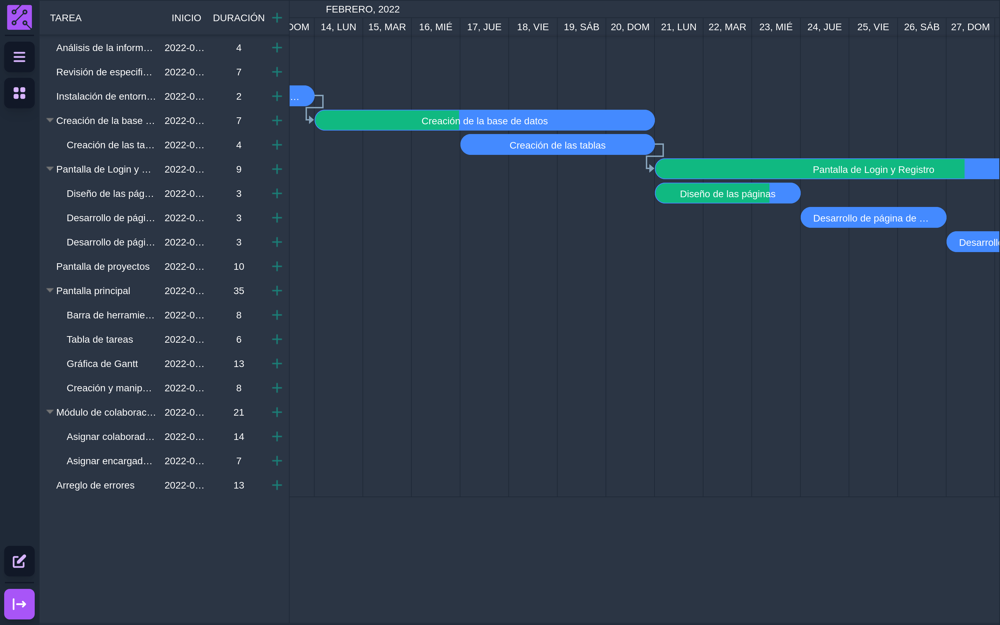

<p align="center">
  <a href="https://ganttician.vercel.app">
    
  </a>

  <p align="center">
    Crea y administra proyectos en con tu equipo!
    <br>
    <a href="https://ganttician.vercel.app"><strong>https://ganttician.vercel.app</strong></a>
  </p>
</p>

# Ganttician
Ganttician permite llevar el control de proyectos a través de una aplicación web.



## Características
- Crear usuarios
- Crear proyectos
- Modificar proyectos
- Crear tareas
- Modificar tareas
- Añadir colaboradores

## Tecnologías
- Vue
- Tailwind CSS
- Supabase

## Desarrollo
### Instalar dependencias
```
yarn
```

### Compila y recarga en caliente para desarrollo
```
yarn dev
```

### Compila para producción
```
yarn build
```
